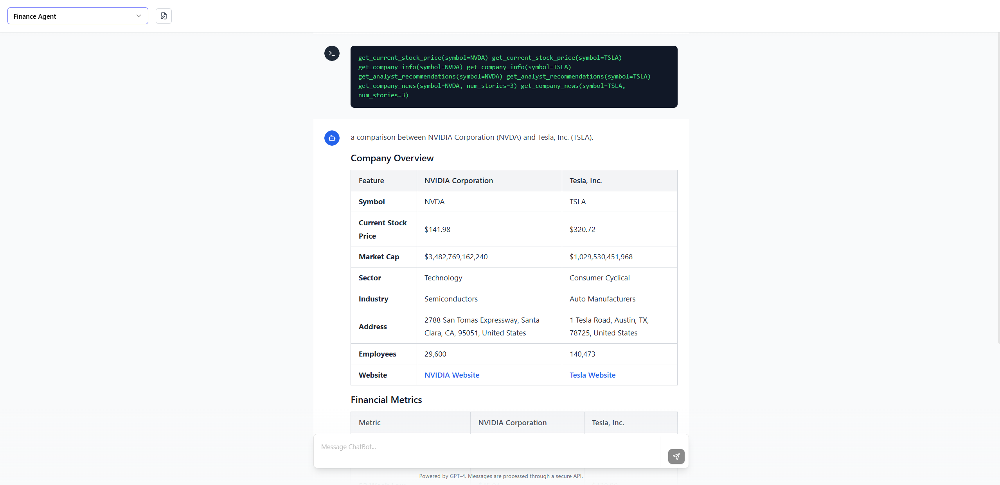

# Phidata Playground UI

A modern chat interface built with React and Shadcn UI for interacting with AI agents through the phidata framework.



## Features

- 🤖 Multiple AI Agent Support
- 💬 Real-time Streaming Chat Interface
- 🎨 Clean, Modern UI with Shadcn Components
- 📝 Markdown Support with Syntax Highlighting
- 🛠️ Tool Call Support

## Tech Stack

- **Frontend Framework**: React
- **UI Components**: [Shadcn UI](https://ui.shadcn.com/)
- **Styling**: Tailwind CSS
- **Markdown**: Marked.js
- **Icons**: Lucide React

## Getting Started

### Prerequisites

- Node.js (v16 or higher)
- npm or yarn
- A running phidata backend server

### Installation

1. Clone the repository:

```bash
git clone https://github.com/pvanand07/phidata-playground-ui.git
```

2. Navigate to the project directory:
   ```bash
   cd phidata-playground-ui
   ```

3. Install dependencies:
   ```bash
   npm install
   # or
   yarn install
   ```

4. Configure your phidata backend url:
  Update `PROD_URL` in `src\api\phidata.js` with your phidata backend url

5. Start the development server:
   ```bash
   npm run dev
   # or
   yarn dev
   ```

## Project Structure

```
src/
├── api/
│   ├
│   └── phidata.js       # Phidata service integration
├── components/
│   ├── ChatBot.jsx      # Main chat interface
│   ├── ChatMessages.jsx  # Message rendering
│   └── MessageInput.jsx  # User input component
├── styles/
│   └── markdown.css     # Markdown styling

```

## Features in Detail

### AI Agent Selection
- Supports multiple AI agents.
- Remembers the last used agent.
- Easy switching between agents.


## License

This project is licensed under the MIT License - see the [LICENSE](LICENSE) file for details.

## Acknowledgments

- [Phidata](https://github.com/phidatahq/phidata) for the AI framework.
- [Shadcn UI](https://ui.shadcn.com/) for the beautiful components.
- [Tailwind CSS](https://tailwindcss.com/) for the styling system.